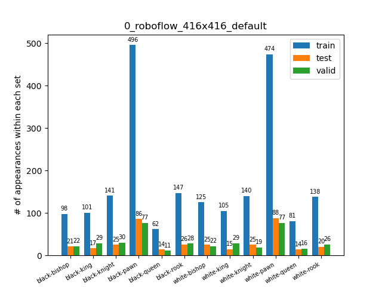
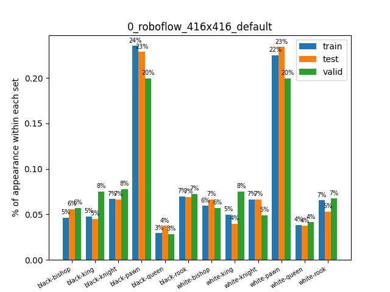
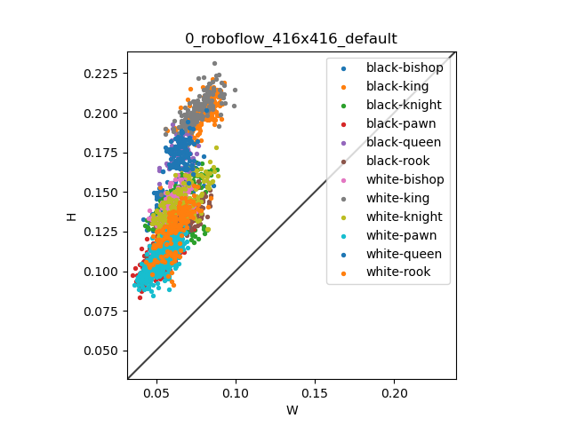
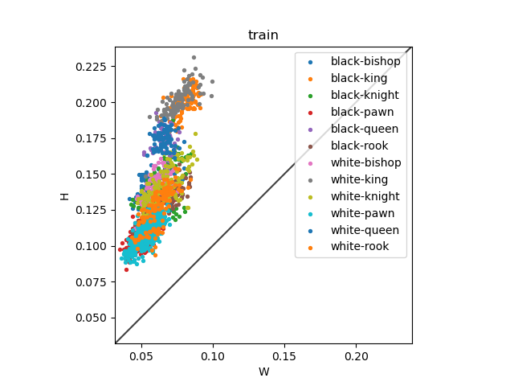
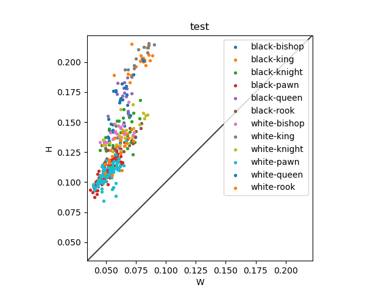
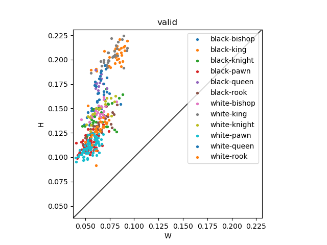

# Some visualization

### Number of bounding boxes, per class, for each dataset

### Repartition in '%' of the bounding boxes, per class, for each dataset

### Distribution of the sizes of the bounding boxes

#### All

#### Train

#### Test

#### Valid

### Overall dumped info

In the txt file [labels_distribution.txt](labels_distribution.txt)
