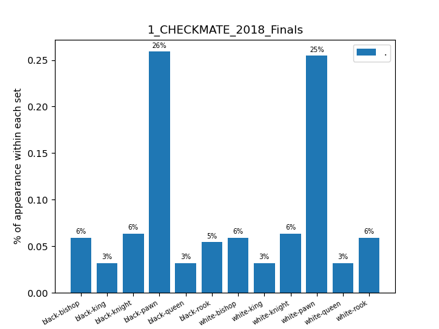

# Some visualization

### Number of bounding boxes, per class, for each dataset

### Repartition in '%' of the bounding boxes, per class, for each dataset

### Overall dumped info

In the txt file [labels_distribution.txt](labels_distribution.txt)
